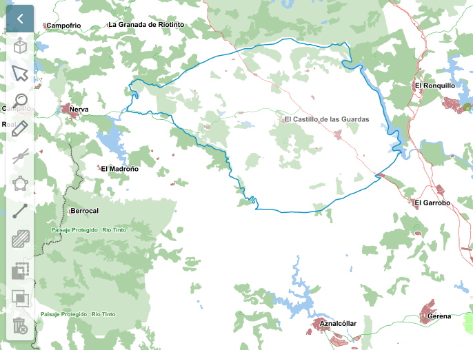

# M.plugin.Edition

Plugin que permite crear y modificar capas.



## Dependencias

- edition.ol.min.js
- edition.ol.min.css


```html
 <link href="../../plugins/edition/edition.ol.min.css" rel="stylesheet" />
 <script type="text/javascript" src="../../plugins/edition/edition.ol.min.js"></script>
```

## Parámetros

- Este plugin no tiene parámetros

## Ejemplos de uso

### Ejemplo 1
```javascript
const mp = new M.plugin.Edition({});

map.addPlugin(mp);
```

